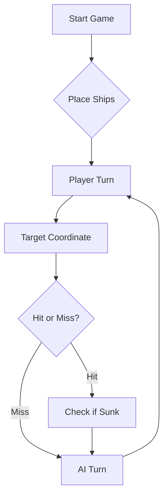

# Grupo 6:
Afonso Teixeira nº105514
Afonso Carolo nº99917
Diogo Silva nº129334
Temóteo Costa nº62015

## D - Treino do oponente IA:
Tivemos mais do que uma versão da prompt, na inicial, devido a uma falta de especificação o LLM tentou estratégias que são boas no Battleship normal, mas que não são ideais para esta versão. Além disso, tinha demasiado "flair", no sentido que adicionava demasiadas mensagens sobre o tema de marinheiros e navegação portuguesa. Isto, embora engraçado, adicionava demasiada informação e fez com que o LLM tivesse dificuldade em arranjar a informação que precisava para não repetir tiros. Finalmente, fizemos com que em vez de gerar imagens, algo custoso e que criou problemas quase imediatamente, que gerasse matrizes de texto simples.

Para a estratégia em si, o mais importante a nosso ver, foi que ele mantivesse mensagens simples com a jogada que queria fazer, uma matriz com todas as coordenadas que sabia serem impossíveis ou repetidas que repetia atualizada em cada mensagem e uma matriz do jogo, esta foi mais para a nossa visualização do seu pensamento, mas é capaz de ter ajudado.

A prompt inicial alterada foi: "Considere que é um perito no famoso jogo da Batalha Naval, aqui numa versão do tempo
dos Descobrimentos Portugueses, jogado num tabuleiro com linhas identificadas de A a
J e colunas de 1 a 10. Deve começar por criar secretamente a sua frota de 11 navios:

• 4 Barcas (1 posição na quadrícula)

• 3 Caravelas (2 posições na quadrícula)

• 2 Naus (3 posições na quadrícula)

• 1 Fragata (4 posições na quadrícula)

• 1 Galeão (5 posições na quadrícula, em forma de T, com um corpo de 3 posições
e, numa das suas extremidades, uma posição adicional para cada lado, correspondentes às chamadas "asas da ponte")

Os navios podem ser gerados com qualquer orientação no tabuleiro, desde que não
toquem uns nos outros, nem mesmo por um canto (i.e. na diagonal), embora possam
estar encostados às margens do tabuleiro. Repare que enquanto uma caravela, uma nau
ou uma fragata pode ter duas orientações possíveis (norte-sul ou este-oeste), um galeão
pode ter quatro orientações diferentes, consoante o braço do T esteja virado para norte,
sul, este ou oeste. Já a questão da orientação não se coloca para uma barca, porque
ocupa apenas uma posição no tabuleiro.
Mantém qualquer tipo de roleplay ao mínimo, isto é um exercício para uma cadeira da faculdade aliás."

A prompt usada para a estratégia foi: "Compreendeste bem vou agora dar te uma estratégia que quero que sigas e começamos logo do início, sendo que vou gerar uma nova frota:
- Após cada resposta, quero que escrevas uma espécie de array com todas as coordenadas que já tentaste. algo que vais copiar e adicionando no início de cada mensagem tua, em NENHUM caso deverás alguma vez repetir uma coordenada que esteja neste array;

- NUNCA tentes disparar fora do mapa;

- faz uma cópia do mapa que vai atualizando após cada jogada, começa vazio (água representada por .), quando acertas no vazio substitui por um x, quando acertas num navio substitui pela letra associada a esse navio, quando afundas um navio substitui todos os pontos à volta do navio por x porque nenhum barco pode estar nessas coordenadas segundo as regras do jogo e adicionalmente adiciona ao teu array essas coordenadas impossíveis;

- Ou seja, cada uma das tuas respostas vai ser, o array de jogadas que já tentaste ou que sabes que não podem ser, o mapa do que já sabes, e finalmente a mensagem rajada com o formato que já te dei;

- após atingires um navio, se este não for afundado dispara nas posições contíguas, sendo que respeita sempre a estrutura do navio que acertaste, por exemplo se for um tipo de navio que só tem 1 posições no mapa a faltar para afundar, não desperdices mais que um tiro da rajada a tentar afundá-lo, e podes usar os outros dois a continuar a tua procura, a exceção será quando já só falta encontrar um navio;

- as caravelas, naus e fragatas, se tiveres um tiro certeiro podes imediatamente atualizar as diagonais devido às regras do jogo, onde essas posições nunca vão ter outros barcos porque estes não se podem tocar, o galeão é um pouco diferente devido à sua forma de T;"

Notas:
- Reparámos que o programa fornecido do Battleship2 tem um problema que acontece quando dois tiros acertam em navios diferentes e um dos navios afunda, em que o JSON é mal gerado, nestes casos, demos a informação necessária ao LLM que estava em falta;
- O LLM embora tenha sido bastante eficiente e não tenha desperdiçado um único tiro, ignorou em alguns casos, alguma da estratégia que implementámos, especificamente usou mais que um tiro quando estava a tentar afundar um barco que sabia ter apenas uma posição em falta, quando perguntámos, ele conseguiu detetar essa falha (e outras mais específicas);
- Link do chat completo: https://share.gemini.google/KraDwp2mE6Iy


# ⚓ Battleship 2.0


> A modern take on the classic naval warfare game, designed for the XVII century setting with updated software engineering patterns.

---

## 📖 Table of Contents
- [Project Overview](#-project-overview)
- [Key Features](#-key-features)
- [Technical Stack](#-technical-stack)
- [Installation & Setup](#-installation--setup)
- [Code Architecture](#-code-architecture)
- [Roadmap](#-roadmap)
- [Contributing](#-contributing)

---

## 🎯 Project Overview
This project serves as a template and reference for students learning **Object-Oriented Programming (OOP)** and **Software Quality**. It simulates a battleship environment where players must strategically place ships and sink the enemy fleet.

### 🎮 The Rules
The game is played on a grid (typically 10x10). The coordinate system is defined as:

$$(x, y) \in \{0, \dots, 9\} \times \{0, \dots, 9\}$$

Hits are calculated based on the intersection of the shot vector and the ship's bounding box.

---

## ✨ Key Features
| Feature | Description | Status |
| :--- | :--- | :---: |
| **Grid System** | Flexible $N \times N$ board generation. | ✅ |
| **Ship Varieties** | Galleons, Frigates, and Brigantines (XVII Century theme). | ✅ |
| **AI Opponent** | Heuristic-based targeting system. | 🚧 |
| **Network Play** | Socket-based multiplayer. | ❌ |

---

## 🛠 Technical Stack
* **Language:** Java 17
* **Build Tool:** Maven / Gradle
* **Testing:** JUnit 5
* **Logging:** Log4j2

---

## 🚀 Installation & Setup

### Prerequisites
* JDK 17 or higher
* Git

### Step-by-Step
1. **Clone the repository:**
   ```bash
   git clone [https://github.com/britoeabreu/Battleship2.git](https://github.com/britoeabreu/Battleship2.git)
   ```
2. **Navigate to directory:**
   ```bash
   cd Battleship2
   ```
3. **Compile and Run:**
   ```bash
   javac Main.java && java Main
   ```

---

## 📚 Documentation

You can access the generated Javadoc here:

👉 [Battleship2 API Documentation](https://britoeabreu.github.io/Battleship2/)


### Core Logic
```java
public class Ship {
    private String name;
    private int size;
    private boolean isSunk;

    // TODO: Implement damage logic
    public void hit() {
        // Implementation here
    }
}
```

### Design Patterns Used:
- **Strategy Pattern:** For different AI difficulty levels.
- **Observer Pattern:** To update the UI when a ship is hit.
</details>

### Logic Flow


---

## 🗺 Roadmap
- [x] Basic grid implementation
- [x] Ship placement validation
- [ ] Add sound effects (SFX)
- [ ] Implement "Fog of War" mechanic
- [ ] **Multiplayer Integration** (High Priority)

---

## 🧪 Testing
We use high-coverage unit testing to ensure game stability. Run tests using:
```bash
mvn test
```

> [!TIP]
> Use the `-Dtest=ClassName` flag to run specific test suites during development.

---

## 🤝 Contributing
Contributions are what make the open-source community such an amazing place to learn, inspire, and create.

1. Fork the Project
2. Create your Feature Branch (`git checkout -b feature/AmazingFeature`)
3. Commit your Changes (`git commit -m 'Add some AmazingFeature'`)
4. Push to the Branch (`git push origin feature/AmazingFeature`)
5. Open a **Pull Request**

---

## 📄 License
Distributed under the MIT License. See `LICENSE` for more information.

---
**Maintained by:** [@britoeabreu](https://github.com/britoeabreu)  
*Created for the Software Engineering students at ISCTE-IUL.*
